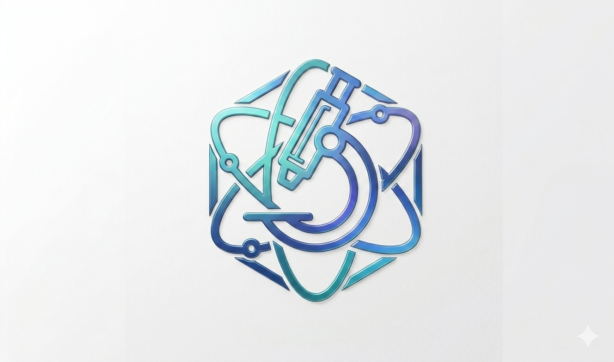

<!-- Improved README template for scl-lab-app -->

<div align="center">
  
  
  ---

  <h1>SCL Lab App</h1>

  **NamAsta Diagnostics** — a <em>professional laboratory management system</em> powered by <strong>Tauri</strong>, <strong>React</strong> & <strong>TailwindCSS</strong>

  <p align="center">
    <a href="#features">Features</a> •
    <a href="#screenshots">Screenshots</a> •
    <a href="#tech-stack">Tech Stack</a> •
    <a href="#getting-started">Getting Started</a> •
    <a href="#contributing">Contributing</a>
  </p>

  <p>
    
    
    
    
    
  </p>

  <p>
    
    
    
  </p>

  <br>
</div>

---

## 📋 Table of Contents

1. [Project Overview](#-project-overview)
2. [Features](#-features)
3. [Screenshots](#-screenshots)
4. [Tech Stack](#-tech-stack)
5. [Getting Started](#-getting-started)
6. [Development](#-development)
7. [Build & Release](#-build--release)
8. [Testing](#-testing)
9. [Project Structure](#-project-structure)
10. [Design System](#-design-system)
11. [Roadmap](#-roadmap)
12. [Contributing](#-contributing)
13. [License & Contact](#-license--contact)

---

## 🩺 Project Overview

SCL Lab App is a **desktop laboratory management system** built for diagnostic centres and medical laboratories. It streamlines the entire workflow from patient registration to report delivery, all within a secure, offline-first native application.

**Why SCL Lab App?**

- ✨ **Blazing Fast** – Native desktop performance with a modern web-tech stack
- 🔒 **Privacy First** – All data stays on your local machine; no cloud dependency
- 🎨 **Beautiful Design** – Carefully crafted UI following strict design principles
- 🖨️ **Print Ready** – Direct integration with lab printers for reports & invoices
- 📱 **WhatsApp Integration** – Send reports directly to patients via WhatsApp

> 💡 **Built for** — Diagnostic labs, pathology centres, clinical laboratories, and medical testing facilities.

---

## ✨ Features

<table>
<tr>
<td width="50%">

### 🏥 Patient Management
- Patient registration & search
- Medical history tracking
- Visit & appointment management

</td>
<td width="50%">

### 🧪 Test Master
- Comprehensive test catalogue
- Panel & profile management
- Reference range configuration

</td>
</tr>
<tr>
<td width="50%">

### 📝 Result Entry
- Quick-result entry interface
- Auto-validation against ranges
- Delta check & historical trends

</td>
<td width="50%">

### 📊 Reports & Billing
- Customisable report templates
- Invoice generation
- Print & PDF export

</td>
</tr>
<tr>
<td width="50%">

### ⚙️ Lab Configuration
- Organization settings
- Printer configuration
- WhatsApp business integration

</td>
<td width="50%">

### 📈 Analytics
- Daily patient dashboards
- Revenue & test volume reports
- Doctor-wise statistics

</td>
</tr>
</table>

---

## 📸 Screenshots

<div align="center">

| **Dashboard** | **Test Master Editor** |
|:---:|:---:|
|  |  |
| *Real-time overview of today's patients, pending reports, and revenue* | *Comprehensive test catalogue with panel & profile management* |

| **Report Preview** |
|:---:|
|  |
| *Professional, print-ready patient diagnostic reports* |

</div>

---

## 🛠️ Tech Stack

**Frontend**
- ⚛️ **React** — UI library
- 🎨 **TailwindCSS** — Utility-first CSS framework
- 📘 **TypeScript** — Type-safe JavaScript
- ⚡ **Vite** — Next-generation frontend tooling

**Desktop**
- 🦀 **Tauri** — Rust-based framework for native desktop apps
- 🗃️ **Tauri Plugin SQL** — SQLite database integration
- 🔄 **Tauri Plugin Updater** — Auto-update capability

**Key Libraries**
- 🔍 **TanStack Query** — Server-state management
- 🧩 **Zustand** — Client-state management
- 📅 **date-fns** — Date manipulation
- 📊 **Recharts** — Data visualisation

---

## 🚀 Getting Started

### Prerequisites

| Tool | Minimum Version | Why |
|------|----------------|-----|
| **Node.js** | 20.x | Runs Vite and the React dev server |
| **npm** | 10.x | Package manager |
| **Rust** (stable) | 1.76+ | Required for the Tauri CLI |

### 1. Clone the Repository

```bash
git clone https://github.com/namansharma/namasta-diagnostics.git
cd scl-lab-app
```

### 2. Install Dependencies

```bash
# Install Node.js dependencies
npm ci          # Recommended: uses exact versions from package-lock.json
```

### 3. Start Development Server

```bash
# Terminal 1 — Vite dev server (React frontend)
npm run dev     # → http://localhost:1420

# Terminal 2 — Tauri desktop window
npm run tauri dev
```

> 💡 **Hot Reload** — Changes to `src/` files trigger instant HMR. Rust changes require a `tauri dev` restart.

---

## 💻 Development

### Available Scripts

| Command | Purpose |
|---------|---------|
| `npm run dev` | Start Vite dev server (frontend only) |
| `npm run tauri dev` | Start Tauri desktop app with dev tools |
| `npm run build` | Production TypeScript + Vite build |
| `npm run tauri build` | Build native binaries for current platform |
| `npm run test` | Run Vitest unit tests (single run) |
| `npm run test:watch` | Run tests in watch mode |

### Recommended VS Code Extensions

- **ESLint** — Linting & code quality
- **Prettier** — Code formatting
- **Tailwind CSS IntelliSense** — Autocomplete for Tailwind classes
- **Rust Analyzer** — Rust language support

---

## 📦 Build & Release

### Production Build

```bash
# 1. Compile frontend + bundle assets
npm run build

# 2. Build native binaries
npm run tauri build
```

**Output:** `src-tauri/target/release/bundle/`
- macOS: `.app` bundle + `.dmg` installer
- Windows: `.msi` installer + `.exe`
- Linux: `.AppImage` + `.deb`

### Release Checklist

1. [ ] Update version in `package.json` & `tauri.conf.json`
2. [ ] Update `CHANGELOG.md`
3. [ ] Tag the commit: `git tag vX.Y.Z && git push origin vX.Y.Z`
4. [ ] Run build steps above
5. [ ] Upload bundles to distribution channel

---

## 🧪 Testing

The project uses **Vitest** for unit and component testing.

```bash
# Run tests once
npm run test

# Watch mode (auto-re-run on changes)
npm run test:watch
```

**Testing Philosophy:** Tests live alongside source files (`*.test.tsx`) and verify that components respect the design-system classes and behave correctly.

---

## 🏗️ Project Structure

```
scl-lab-app/
├── 📁 public/                  # Static assets (icons, logos)
├── 📁 src/                     # Source code
│   ├── 📁 app/                 # Tauri bootstrap + tauri.conf.json
│   ├── 📁 assets/              # Images, fonts, icons
│   ├── 📁 components/          # Reusable React components
│   │   ├── 📁 ui/              # Atomic UI components (buttons, inputs, tables)
│   │   └── 📁 layout/          # Layout components (sidebar, header, cards)
│   ├── 📁 lib/                 # Business logic & utilities
│   │   ├── 📁 api/             # API clients & data fetching
│   │   ├── 📁 db/              # Database helpers & schemas
│   │   └── 📁 utils/           # Helper functions
│   ├── 📁 pages/               # Route-based page components
│   │   ├── 📁 dashboard/
│   │   ├── 📁 test-master/
│   │   ├── 📁 patients/
│   │   ├── 📁 result-entry/
│   │   ├── 📁 report-preview/
│   │   ├── 📁 settings/
│   │   └── 📁 onboarding/
│   ├── 📁 types/               # Shared TypeScript types
│   ├── 📁 hooks/               # Custom React hooks
│   ├── 📄 App.tsx               # Root component (router, providers)
│   ├── 📄 main.tsx              # React entry point
│   └── 📄 index.css             # Global Tailwind + design-system primitives
├── 📁 src-tauri/
│   ├── 📁 src/                 # Rust backend code
│   ├── 📁 icons/               # App icons
│   └── 📄 Cargo.toml            # Rust dependencies
├── 📁 docs/
│   └── 📁 screenshots/           # README screenshots
├── 📄 vite.config.ts            # Vite configuration
├── 📄 tailwind.config.ts        # Tailwind configuration
├── 📄 tsconfig.json             # TypeScript configuration
├── 📄 package.json              # Node dependencies
├── 📄 DESIGN.md                 # Design system specification
└── 📄 CHANGELOG.md              # Version history
```

---

## 🎨 Design System

The UI adheres to a **strict design specification** defined in `DESIGN.md`. All components use predefined CSS primitives—**no custom colours, borders, or radii** outside the system.

| Token | Value | Usage |
|-------|-------|-------|
| **Maroon** | `#7b1b1b` | Primary brand, buttons, active states |
| **Navy** | `#1e3f8f` | Secondary brand, links, accents |
| **Off-White** | `#f5f2ec` | Page backgrounds |
| **Primary Text** | `#1a1a1e` | Headlines, body text |
| **Secondary Text** | `#5d5953` | Sub-headings, captions |

### CSS Primitives

```css
.card          /* White bg, 14px radius, hairline shadow */
.field         /* Standardised input styling */
.btn-primary   /* Maroon gradient button */
.btn-secondary /* White outline button */
.chip-*        /* Status chips (gray/amber/green/blue/red) */
.animate-*     /* Fade-up, scale-in transitions */
```

**Font:** Inter Variable (via `@fontsource-variable/inter`)

---

## 🗺️ Roadmap

- [x] Patient registration & search
- [x] Test master with panels & profiles
- [x] Result entry with auto-validation
- [x] Report preview & print
- [x] Billing & invoicing
- [x] WhatsApp report delivery
- [ ] Multi-user role management (Admin, Technician, Receptionist)
- [ ] Barcode & label printing
- [ ] SMS report delivery
- [ ] Cloud sync backup
- [ ] Mobile companion app
- [ ] HL7 / FHIR integration

> 💬 **Have a suggestion?** [Open an issue](https://github.com/namansharma/namasta-diagnostics/issues) or [start a discussion](https://github.com/namansharma/namasta-diagnostics/discussions).

---

## 🤝 Contributing

Contributions are welcome! Please follow these steps:

1. **Fork** the repository and create your feature branch:
   ```bash
   git checkout -b feat/amazing-feature
   ```

2. **Follow the design system** — Use only the `.card`, `.field`, `.btn`, `.chip-*`, and `.animate-*` families defined in `src/index.css`. No custom colours or border-radii.

3. **Write tests** — Add or update tests in `*.test.tsx` files.

4. **Commit with meaning** — Use conventional commit messages:
   ```bash
   git commit -m "feat: add patient search filter"
   ```

5. **Push and open a PR**
   ```bash
   git push origin feat/amazing-feature
   ```

> ⚡ CI runs `npm run build && npm run test` on every pull request.

---

## 📜 License & Contact

**NamAsta Diagnostics**

- 📧 **Email:** [hello@namastadiagnostics.com](mailto:hello@namastadiagnostics.com)
- 🌐 **Website:** [www.namastadiagnostics.com](https://www.namastadiagnostics.com)
- 🐛 **Issues:** [GitHub Issues](https://github.com/namansharma/scl-lab-app/issues)

> ⚠️ **Private Software** — This is proprietary software. See `LICENSE` for usage terms. All rights reserved by NamAsta Diagnostics.

---

<div align="center">
  <p>
    <sub>Built with ❤️ by the <strong>NamAsta Diagnostics</strong> team</sub>
  </p>
  <p>
    <a href="#top">⬆️ Back to top</a>
  </p>
</div>
