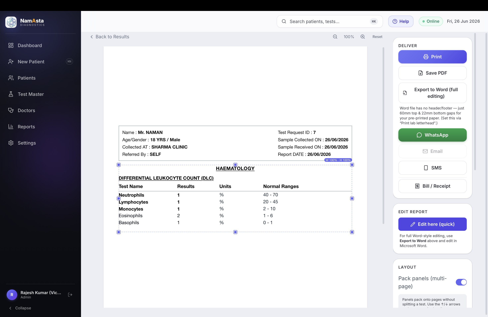
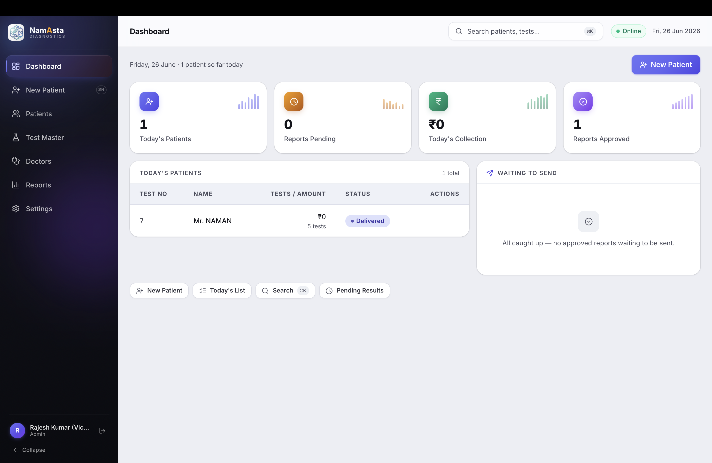
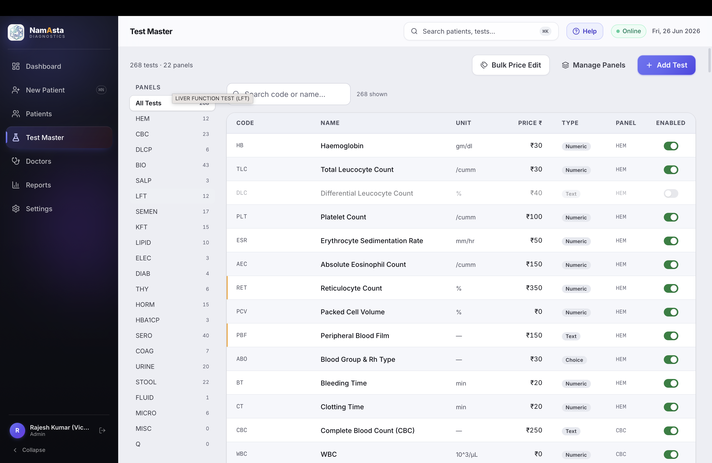

# SCL Lab App

> **NamAsta Diagnostics** – a Tauri‑powered desktop application built with React, TypeScript, and TailwindCSS.
> The app follows a strict design system (maroon `#7b1b1b`, navy `#1e3f8f`, warm off‑white background) and uses the shared CSS primitives defined in `src/index.css`.

## Table of Contents

1. [Project Overview](#project-overview)
2. [Design System](#design-system)
3. [Prerequisites](#prerequisites)
4. [Setup & Development](#setup--development)
5. [Build & Release](#build--release)
6. [Testing](#testing)
7. [Project Structure](#project-structure)
8. [Contributing](#contributing)
9. [License & Branding](#license--branding)
10. [Screenshots](#screenshots)

---

## Project Overview

The SCL Lab App is a **Tauri** desktop client that provides lab‑technician workflows for:

- Patient registration and management
- Test result entry and review
- Billing / invoicing and reporting
- Configuration of lab‑wide settings (branding, printers, WhatsApp integration, etc.)

It is a **single‑page React** application rendered inside a native Tauri window, giving you:

- Fast‑startup native UI
- Access to OS‑level features via the Tauri plugins (`plugin-sql`, `plugin-shell`, `plugin-updater`, …)

> **Note** – All UI components obey the design‑system primitives defined in `src/index.css`. No custom borders, shadows, or colors should be added outside those primitives.

---

## Design System

The UI adheres to the **strict design spec** defined in `DESIGN.md`. The key points are reproduced here for quick reference.

| Primitive | Description | Usage |
|-----------|-------------|-------|
| `.card` | White background, 14 px radius, hairline shadow | Page sections, dialog panels |
| `.field` | Standardised input/select/textarea styling | Forms & filters |
| `.btn .btn-primary` | Maroon gradient button | Primary actions |
| `.btn .btn-secondary` | White outline button | Secondary actions |
| `.chip‑gray / amber / green / blue / red` | Status chips (registered, pending, approved, delivered, danger) | Table rows, tags |
| `.table‑head` | Header typography for tables | Table `<thead>` |
| `.animate‑fade‑up` | Page‑level block animation | Page sections |
| `.animate‑scale‑in` | Dialog/popover open animation | Modals, side‑sheets |
| Colors | Primary text `#1a1a1e`, secondary `#5d5953`, muted `#8a857d` | All text |
| Brand colors | Maroon `#7b1b1b`, Navy `#1e3f8f` | Buttons, links, selected states |

All pages follow the **Page Anatomy** described in `DESIGN.md` (no `<h1>` tags, header row with optional subtitle + primary action, cards separated by `space-y-4`, etc.).

The project uses **Inter Variable** as the global font, loaded via `@fontsource-variable/inter`.

---

## Prerequisites

| Tool | Minimum version | Why |
|------|----------------|-----|
| **Node.js** | 20 + | Runs Vite and the React dev server |
| **npm** | 10 + | Package manager |
| **Rust** (stable) | 1.76 + | Required for the Tauri CLI (`cargo`) |
| **Tauri CLI** | 2 + | Bundles the native app (`npm run tauri …`) |
| **Xcode command‑line tools** (macOS) | – | Needed for native builds (`xcode-select --install`) |

### Install Rust & Tauri

```bash
# Rust toolchain (via rustup)
curl https://sh.rustup.rs -sSf | sh

# Add the Tauri CLI
cargo install tauri-cli
```

### Install project dependencies

```bash
cd /Users/namansharma/Projects/scl-lab-app
npm ci          # installs exact versions from package-lock.json
```

---

## Setup & Development

```bash
# 1️⃣ Install dependencies (once)
npm ci

# 2️⃣ Start the Vite dev server (serves the React front‑end)
npm run dev    # → http://localhost:1420

# 3️⃣ In another terminal, launch the Tauri window in dev mode
npm run tauri dev
```

> **Port conflict** – If `localhost:1420` is already in use, kill the offending process (`lsof -i :1420 && kill -9 <PID>`) and restart the commands.

The desktop window automatically reloads when you edit source files.

### Hot‑reloading notes

- Files under `src/` trigger Vite HMR.
- Changes to Tauri‑side Rust code require a full restart of `npm run tauri dev`.

---

## Build & Release

```bash
# 1️⃣ Compile TypeScript + bundle assets
npm run build

# 2️⃣ Build native binaries for the current platform
npm run tauri build
```

The result ends up in `src-tauri/target/release/bundle/` (macOS `.app` bundle and DMG).

**Release process** (see `RELEASING.md`)

1. Update `package.json` version.
2. Tag the commit (`git tag vX.Y.Z && git push origin vX.Y.Z`).
3. Run the build steps above.
4. Upload the generated bundle to your distribution channel.

---

## Testing

The repo uses **Vitest** for unit and integration tests.

```bash
npm run test           # run once
npm run test:watch     # watch mode (auto‑re‑run on changes)
```

Tests live alongside source files (`*.test.tsx`) and verify that components respect the design‑system classes.

---

## Project Structure

```
src/
├─ app/               # Tauri bootstrap (main.ts, tauri.conf.json)
├─ assets/            # Images, icons, static assets
├─ components/        # Re‑usable React components (cards, tables, dialogs)
├─ lib/               # Business logic, API clients, utilities
├─ pages/             # Route‑based pages
│   ├─ dashboard/
│   │   ├─ DashboardPage.tsx
│   │   ├─ StatCards.tsx
│   │   └─ TodayPatientsTable.tsx
│   ├─ test‑master/
│   │   ├─ TestMasterPage.tsx
│   │   ├─ PanelEditorSheet.tsx
│   │   └─ TestSheet.tsx
│   ├─ report/
│   │   └─ ReportPreviewPage.tsx
│   └─ … (other feature pages)
├─ types/             # Shared TypeScript types & interfaces
├─ index.css          # Global Tailwind + design‑system primitives
├─ App.tsx            # Root component (router, query client)
└─ main.tsx           # React entry point
```

Other top‑level files

- `vite.config.ts` – Vite + Tailwind integration
- `tsconfig.json` – TypeScript compiler options
- `CHANGELOG.md`, `DESIGN.md`, `SETUP‑GUIDE.md` – Documentation

---

## Contributing

1. **Fork** the repository and create a feature branch (`git checkout -b feat/your‑feature`).
2. Follow the **design‑system primitives** – never create custom colors, borders, or radii. Use the `.card`, `.field`, `.btn` families defined in `src/index.css`.
3. Run the linter (via `npm run test` or `npm run lint` if added later) and ensure **Vitest** passes.
4. Commit with a concise, purpose‑focused message (e.g., `feat: add patient search filter`).
5. Push and open a PR. CI runs `npm run build && npm run test`.

### Code‑style notes

- **Tailwind utilities** must be limited to the classes defined in the design system; avoid arbitrary `bg-gray-200`, `rounded-lg`, etc.
- Use **`clsx`** for conditional class composition (already a dependency).
- Keep business logic inside `src/lib/`; UI code stays in `src/components/` or page files.

---

## License & Branding

- The app is **private** (`"private": true` in `package.json`).
- Branding follows the SCL palette described above; any external assets must be approved by the design team.

---

## Screenshots

| Page | Screenshot |
|------|------------|
| **Dashboard** |  |
| **Test Master Editor** |  |
| **Report Preview** |  |

*If you prefer the images to be version‑controlled, copy the PNG files into the repository (e.g., `docs/screenshots/`) and update the paths accordingly.*
